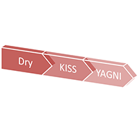
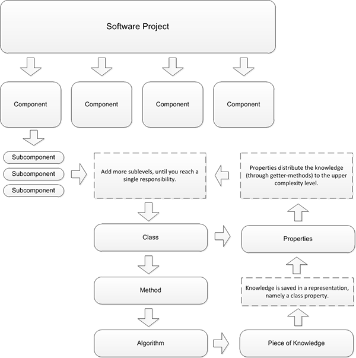
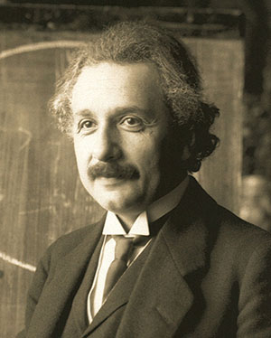
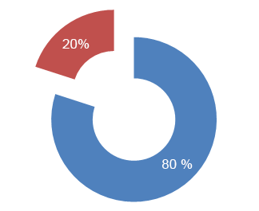

# 软件开发中的三个重要原则

**What’s true for love, is true for code.**

在我们软件开发的职业生涯中，新的技术、语言和概念层出不穷。我们也时常产生焦虑和质疑：“我还能跟上时代的变化、保持竞争力了吗？”让我们回顾一下经典电影“卡萨布兰卡”里的一句台词：“A kiss is just a kiss. A sigh is just a sighThe fundamental things apply, as time goes by.”翻译过来的意思应该就是：“长叹虽然年复一年，甜吻永留心间，随时光流逝，爱情真谛永不变。”

>If you’re in software development, new techniques, languages and concepts pop up all of the time. We all feel those nagging doubts every now and then: “can I keep up with the changes and stay competitive?” Take a moment, and sum a line from my favourite movie, Casablanca: “The fundamental things apply, as time goes by.”

适用于爱情的真理也同样适用于编码，基本的原理是永远不会改变的。如果我们能够掌握软件开发的一些理念，就能非常容易地调整自己去适应这些新的技术。这篇文章里讨论了软件开发的三个基本原则，并且结合了许多其它事物进行阐述。这三个原则为管理软件的复杂度提供了有力的方法。我也在这里分享一下我的观点和想法，希望当你们进行真实世界中的项目开发时，会发现这些原则非常有用。

>What’s true for love, is true for code. The fundamental things will always apply. If you have an understanding of the underlying ideas of software development, you will quickly adjust to new techniques. In this tutorial, we will discuss three basic principles and mix them with many more. They provide a powerful way of managing the complexity of software. I’ll share some of my personal opinions and thoughts, which, hopefully, will prove useful when it comes to applying them to code and real-world projects.

---
## 原则1：DRY。Don’t Repeat Yourself

**A basic strategy for reducing complexity to managable units is to divide a system into pieces.**

理解这个原则非常重要，DRY是Don’t Repeat Yourself的缩写，最早由Andy Hunt和Dave Thomas在《The Pragmatic Programmer》提出，不过这个概念本身其实很早就广为人知了，指的是软件里的最小部分。

 >This principle is so important to understand, that I won’t write it twice! It’s commonly referred to by the acronym, DRY, and came up in the book [The Pragmatic Programmer](http://www.amazon.com/gp/product/020161622X/ref=as_li_ss_tl?ie=UTF8&tag=nett02-20&linkCode=as2&camp=1789&creative=390957&creativeASIN=020161622X), by Andy Hunt and Dave Thomas, but the concept, itself, has been known for a long time. It refers to the smallest parts of your software.

我们在构建一个大型软件项目时，通常会被整体复杂性搞得不知所措。我们人类并不善于管理错综复杂的事物，在特定的范围之内找到创造性的解决方案倒是比较拿手。解决复杂性的最基本的策略是将系统分成若干个容易处理的部分。起初，你可能想将系统按组件划分，每个组件代表了一个子系统，其中包含了完成特定功能所需的一切事物。

>When you are building a large software project, you will usually be overwhelmed by the overall complexity. Humans are not good at managing complexity; they’re good at finding creative solutions for problems of a specific scope. A basic strategy for reducing complexity to managable units is to divide a system into parts that are more handy. At first, you may want to divide your system into components, where each component represents its own subsystem that contains everything needed to accomplish a specific functionality.

比如在开发一个内容管理系统CMS时，负责用户管理的部分就是一个组件。这个组件可以被进一步划分成更小的子组件，比如角色管理组件，角色管理组件还可以跟其它组件通讯，比如安全组件。

>For example, if you’re building a content management system, the part that is responsible for user management will be a component. This component can be divided into further subcomponents, like role management, and it may communicate with other components, such as the security component.

组件还可以往下再分，进一步拆分成子组件，这样复杂性将被降低到单一职责（single responsibility），每个职责可以使用一个类来实现（假设我们用OOP开发），类包含了方法和属性。方法实现算法，这些算法和算法的子部分是构成软件业务逻辑的最小知识块。你只需要保证这些块不重复即可。

>As you divide systems into components, and, further, components into subcomponents, you will arrive at a level, where the complexity is reduced to a single responsibility. These responsibilities can be implemented in a class (we assume that we’re building an object-oriented application). Classes contain methods and properties. Methods implement algorithms. Algorithms and – depending on how obsessive we want to get – subparts of
algorithms are calculating or containing the smallest pieces that build your business logic.

**DRY原则规定这些小的知识块在整个系统里只能出现一次。**

>**The DRY principle states that these small pieces of knowledge may only occur exactly once in your entire system.**

这些小的知识块的外在表现是不变的。

>They must have a single representation within it.

请注意小知识块的内部实现和其外在表现之间差异。如果我们在CMS系统里实现数据库的连接，会有一个代码片段来初始化数据库驱动、传递认证数据、在一个变量里保存对数据库连接，这个代码片段就是如何获取信息的知识块的一部分。这个保存数据库连接的变量就是知识块的外在表现，可以被系统的其它部分使用，如果数据库认证信息发生了变化，我们必须更改连接数据库的代码片段，但是包含该代码片段的部件的外在表现并不会变化。

 >Note the difference between the piece of knowledge, and its representation. If we’re implementing the database connection in our CMS, we will have a code snippet that will initalize the database driver, pass the credentials, and save a reference to the connection in a variable. The code snippet is part of the knowledge, it’s about how something is achieved. The variable with the reference to the connection is the representation of that knowledge – and this can be used by other parties. If the database credentials change, we will have to change the snippet – not its representation.

在一个完美的应用程序中，每一小块业务逻辑将被封装在一个表征中，也就是一个变量或一个类。变量被封装在一个能够被描述为一个职责表征的类中，类被封装在一个能被描述为功能表征的组件中。

>In a perfect application, every small piece of business logic encapsulates its knowledge in a representation, namely a variable or a class property. This variable itself is encapsulated in a class that can be described as a representation of a responsibility. The class is encapsulated in a component that can be described as a representation of functionality.

这个封装过程一直持续到软件项目的最上层：越来越复杂的表现形式的累加。这种方式称为模块化构造，DRY 原则是其一个重要的部分。

>This can be proceeded until we reach the top level of our software project – that is, a stack of representations with increasing complexity. This way of looking at the complexity of software is called modular architecture, and DRY is an important part of it.

**DRY 原则规定，在整个系统中，每一个小的知识块只可能发生一次，且每个知识块必须有一个单一、明确、权威的表征。**

>**Every piece of knowledge must have a single, unambiguous, authoritative representation within a system.**

软件体系结构就是用来管理复杂度的

---
### 实现DRY

**DRY is a philosophy that packages logic into representations.**

有很多途径可以实现DRY，Hunt和Thoms建议使用代码生成器和数据转换，不过从本质上来说，DRY是把业务逻辑封装成表征的哲学。

>There are many ways of achieving DRYness. Hunt and Thomas suggested (among other things) code generators and data transforming. But, essentially, DRY is a philosophy that packages logic into representations.

由于应用程序的每个部分都可以作为表征而被看到，每个部分都显露了潜在业务逻辑的部分片段：用户管理表征了对CMS注册用户的存取，用户类表征了单一的用户并揭示了这个用户的属性，用户类通过数据库的表征获取它的属性。

>As every part of your application can be seen as representation, every part exposes specific fragments of your underlying logic: The user management exposes access to registered users of the CMS, the user class represents a single user and exposes his properties (like the username). It retrieves the properties, via the representation of the database.

DRY和模块化构造需要良好的计划，以自底向上地实现层次化的表征、划分应用程序为逻辑上独立的单元、并让它们彼此通讯。如果我们在管理更大型的项目，把项目组织成组件并在组件内部使用DRY原则是一个好主意。可以应用如下规则：

1. 绘制软件架构图，并映射主要的组件，复杂的项目可能需要为每个组件绘制一个专门的架构图。
1. 如果你到达了连接职责的层级，你可能需要转换到 UML 图。
1. 在写代码块之前，根据它在项目中的层级命名。定义它代表什么，并确定你知道它在组件中的作用。
1.定义表征应该展示的内容（如功能是在数据库驱动程序中执行 SQL）以及应该隐藏的内容（如数据库认证信息）。
1. 确保表征不依赖于另一个复杂层级的表征（如一个组件依赖于另一个组件中的类）。

>DRY and modular architecture require good planning. To achieve a representational hierachy from bottom-up, divide your application in a hierarchy of logically separated smaller parts and let them communicate with each other. If you have to manage larger projects, organizing them into components and using DRY within the components is a good idea. Try to apply the following rules:

>1. Make a visual hierarchy of your software application and map the main components to it. Complex projects may require a dedicated map for each component.
>1. If you’re arriving at a level of connected responsibilities, you may want to switch to UML diagrams (or similar).
>1. Before writing a chunk of code, name its hierarchy in your software project. Define what it’s representing, and be sure you know its role in the surrounding component.
>1. Define what the representation should expose to other parties (like functions to execute SQL in a database driver) and what it should hide (like the database credentials).
>1. Ensure that representations do not rely on representations of another complexity level (like a component that relies on a class in another component).

**当你发现正写的代码与之前写过的代码类似或相同，你就需要花时间来考虑你正在做什么，并确保不重复自己。**

>**When you find yourself writing code that is similiar or equal to something you’ve written before, take a moment to think about what you’re doing and don’t repeat yourself.**

现实世界中，应用程序做到100%DRY是困难的，但不是不可能实现的。然而应用程序的“非DRY”化达到了无法接受的程度的情况却非常普遍。如果我们看了这些项目的代码，就不会对超过50%的项目最终失败感到惊讶了。

>In the real world, applications that are a 100% DRY are hard, if not impossible, to achieve. However, applications that are unDRY to an unacceptable degree – and therefore hard to maintain – are quite common. Hence, it’s not surprising to learn that more than 50% of all software projects fail – if you’re taking a look at the code.

很多人认为质量差的代码来自水平差的编码者，不过以我的经验来看，这是非常例外的情况。更多的不良代码往往是因为项目经理或公司的整体软件过程配置管理错误引起的。

>Many people tend to think that bad code is produced by bad coders. In my experience, this is very much an exception. More often than not, bad code is produced by bad account managers and an overall misconfiguration of process management in companies.

___
### 一个例子

**Bad code is rarely produced by bad coders.**

举一个例子，假设你是某公司的技术顾问，这个公司存在代码质量和维护上的问题。你通过评审这些源代码发现了漏洞和代码重复（部分代码不符合DRY原则），不过这只是代码质量不佳的症状，而不是原因。如果继续查看版本管理系统里的代码历史，一般都会发现问题往往发生在里程碑或截止阶段。再花点时间看看发生了哪些更改，就会发现其实是需求发生了变化。

 >As an example, say you’re hired as a technical consultant by a company that has problems with code quality and maintenance. You review the source and you see hacks and code duplication – the code is not DRY. This is a symptom of bad code quality, it’s not the reason. If you take a look at the version control system – aka the history of the code – chances are that you may find hacks that were introduced at times near deadlines and milestones. Take the time to review what changes are made, and you will likely be confronted with a change in requirements.

**DRYness is achieved by good planning.**

如上面提到的一样，DRY化需要良好的计划，在工期紧张的项目上强加各种需求变化往往迫使开发人员实施“脏”的方案。一旦代码被发布出去，DRY原则完全有可能进一步被牺牲以适应后续变化。

>As noted above, DRYness is achieved by good planning. Forced changes on a tough deadline are forcing developers to implement dirty solutions. Once the code is compromised, the principle of DRY is likely to be sacrificed completely upon further changes.

在IT领域最成功的那些公司是由对技术具有良好理解的人或编码人员创建的，就是由于这个原因，他们知道应该把精力放在何处。相反，许多其他公司把需求工程相关的事情交给客户经理来做、把概念抽象的事情交给商业顾问来做，而这些人永远不会实现任何功能。

>There’s a reason why the most successful corporations in the IT business were founded by people with very good technical understanding – or even coders themself: Bill Gates, Mark Zuckerberg, Steve Wozniak, Steve Jobs, Larry Page, Sergey Brin and Larry Ellison know (or knew) what efforts are needed to implement something. Contrary, many companies tend to lay the requirements for engineering into the hands of account managers, and the conceptual part in the hands of business consultants…**people who have never implemented anything**.

因此，许多技术概念仅仅在PPT、Photoshop和显示器上运转，这应该可以在过去的静态网站上取得成功，但已经不适用于现在了——应用程序在多个设备上进行交互。因为开发人员是项目的最后防线，他们是运用这些概念快速修复错误的人。如果是客户经理参与这个过程，他不能反对客户在最后时刻做出修改，所有的计划都不起作用，快速但不安全的方案被实现，代码就不能DRY了。

>Hence, many technical concepts work only in Powerpoint, Photoshop, and on 27″ widescreen displays. This may have been a successful approach in the days of, more or less, static websites, but it’s not nowadays – with interactive applications on multiple devices. Because coders are the last in the line, they are the ones who have to apply quick fixes on errors in the concept. If this is accompanied by an account manager, who can’t stand up to a client that likes to make last-minute changes, plans are thrown in the garbage, and something quick and dirty is implemented. The code becomes unDRY.

这个例子有点极端（不过我曾经目睹过这样的场景），但是它展示了DRY作为一个理论概念，总是会被现实世界中的多种因素干扰，如果我们工作在迫使我们不能按照DRY方式工作的哦那公司，应该对建议对这个软件过程给予变化。

>This example is a bit extreme (nevertheless, I have witnessed such scenarios), but it demonstrates that DRY is a theoretical concept, which is challenged by various parties in the real world. If you’re working in a company that forces you to work in this manner, you might suggest some changes to the process (like introducing technical expertise at an earlier stage of technical projects).

如果你的项目已经启动了，原则“You ain’t gonna need it”可以来为你救场。

If you have a hands-off approach, keep reading! The You ain’t gonna need it principle will come to the rescue.

___
## 原则二：KISS（Keep it Simple Stupid）尽量简单、一目了然

**The simplest explanation tends to be the right one.**

19世纪晚期，物理学家们试图解释万有引力、磁场、光学之间在长距离传输时的相互作用，比如在太阳系。因此假设了一个名为“以太”的媒介，光通过这个媒介传输，它承担了那些无法解释的效果的责任。后来，有引入了更多假设的实验结果，有些假设过于武断从来引发了新的问题，最终使整个理论相当复杂。

 >In the late 19th century, physicists struggled to explain how gravity, magnetism and optics interact, when it comes to large distances – like the distances in our solar system. Hence, a medium named aether was postulated. It was said, that light is traveling through this medium, and that it’s responsible for effects that couldn’t be explained otherwise. Through the years, the theory was expanded with assumptions that adjusted the aether postulate to the results of experiments. Some assumptions were arbitrary, some introduced other problems, and the whole theory was quite complex.

爱因斯坦建议抛弃整个以太理论，他介绍了一个简单、但是很具革命性的设想：相对论。这令人难以置信的创新思维使用最少的假设、选择了最简单的解释。

>An employee of the swiss patent office, Albert Einstein, suggested to get rid of the whole aether theory when he introduced a simple, yet revolutionary idea: All the oddness in calculating with large distances would fade away if we’d accept that time is not a constant; it’s relative. This incredibly of out-of-the-box thinking to come to the simplest explanation with the fewest assumptions to select between competing scenarios is referred to as Ockhams’s Razor.

很多领域都有类似的概念，在软件开发领域，我们称之为KISS。这个缩写有很多变种，但他们都表示，你应该争取做一些最简单的事情。

>There are similar concepts in many areas. In software development (and others), we refer to it as KISS. There are many variants for this acronym, but they all mean that you should strive for the simplest way of doing something.

---
### HTTP

超文本传输协议被广泛认为是一个简单的解决方案完美的例子：传输超文本文档，它是现在高度互动的应用程序和桌面式应用程序的骨干。也许，我们必须为协议中的某些限制找到的解决方案，也许有一天我们必须更换这个协议。然而，现状是：在请求方法（如GET和POST）、状态代码和纯文本参数的基础上，HTTP已被证明是灵活而强大的。这就是为什么HTTP被web开发者反复推动了极限 - 并且仍然屹立不倒得原因。

>The Hypertext Transfer Protocol is widely considered to be a perfect example for a simple solution: designed to transfer hypertext based documents, it is the backbone of highly interactive and desktop-esque applications nowadays. Maybe we have to find solutions for limitations in the protocol, and maybe we have to replace it someday. However, status quo is: based on a few request methods (like GET and POST), status codes and plain text arguments, HTTP has proved to be flexible and robust. That’s why HTTP has been repeatedly pushed to the limits by web developers – and is still standing.

Internet的成功也可以认为是简单但有效的解决方案的成功。

>We take this approach for granted, but the history of software development and standardization is full of overly complex and half-baked solutions. There’s even a dedicated made-up word for it: bloatware. Software like this is also described to be DOD, dead on arrival. I have a theory that is very similar to my theory of unDRY code, when it comes to bloatware … However, the success of the internet can be described as a success of simple, yet efficent solutions.

如何做到简单且一目了然呢？这要归结到软件开发的可维护性和可理解性。KISS 原则往往体现在需求设计阶段，当你考虑如何将客户的需求转变成一个可实现组件时，尝试确认以下部分：

* 收益和成本比例不协调的功能
* 高度依赖其他功能的功能
* 可能会变得复杂的功能

 >So what’s required to come to the simplest solution possible? It all comes down to maintainability and comprehensibility in software development. Hence, KISS kicks in during the phase of requirements engineering. When you think about how to transform a client’s requirements to implementable components, try to identify the following parts:

> * Functionality that has an inappropriate ratio between benefit and efforts.
> * Functionality that is highly dependent on other functionality.
> * Functionality that is likely to grow in complexity.

**There are many people involved in the conceptual process, who do not have the technical expertise to make a reliable cost-benefit analysis.**

此处作者举了一个自己实际遇到的一个案例：Excel vs CSV。在软件中运用Excel一般就是需要导入数据，支持CSV就够了，而且CSV是通用格式。相反，Excel格式众多、公式多样、版本更新迅速，对其进行支持实际上就是成本和收益严重不符。

>I was once working on a project, where the client wanted to import Excel spreadsheets into his crew management software. This was a clear match. Excel is a proprietary software with a complex document format. The format is complex, because it’s feature-rich: You can add graphs and other things to it – features that were not needed by the client. He was simply interested in the numbers. Thus, implementing the Excel import would require the implementation of a lot of unnecessary functionality. On top of that, there are multiple versions of Excel versions, and Microsoft fires off another release each year. This would have been hard to maintain, and it comes with additional costs in the future.

>We ended up implementing a comma-separated-value import. This was done with a few lines of code. The overhead of the data was really small (compare an Excel sheet to it’s CSV equivalent) and the solution was maintainable and future-proofed. Excel was ready to export CSV anyway (as well as other programs that the client might want to use in the future). Since the solution was low-priced as well, it was a good application of the KISS principle.

总而言之，如果一个任务看起来超复杂，试着去考虑一种创造性、独特的方式。多花时间去讨论关键点，看是否有其他更合适的方案。很多时候，我们不要仅仅考虑业务概念，也要考虑需求的成本效益分析。

>To sum up: try to think out-of-the box if a task looks complicated to you. If someone is explaining to you his requirements, and you’re thinking that it’ll be tough and complex to implement, you’re right under almost any circumstances. While some things are just that – hard to implement – overcomplicated solutions are quite usual. This is the case because there are many people involved in the conceptual process, who do not have the technical expertise to make a reliable cost-benefit analysis. Hence, they don’t see the problem. Double-check the requirements whether they are really stripped down to the essence that the client needs. Take the time to discuss critical points and explain why other solutions might be more suitable.

---
## 原则三：YAGNI(You “Ain’t Gonna Need It)适可而止

**Coding is about building things.**

无论使我们投入软件开发这个行业的推动力是什么，我们都会经常面临无聊、重复的开发工作或任务。

>When Google+ launched, Mark Zuckerberg – founder of Facebook – was one of the first who created an account in the social network that was aiming to take his own down. He added just one line to the About me section: »I’m building things.«. I honestly think that this is a brilliant sentence, because it describes the pure essence of coding in a few simple words. Why did you decide to become a coder? Enthusiasm for technical solutions? The beauty of efficiency? Whatever your answer is, it may not be »building the 1.000.001th corporate website with standard functionality«. However, most of us are making money that way. No matter where you are working, you’ll likely be confronted with boring and repetitive tasks every now and then.

**80% of the time spent on a software project is invested in 20% of the functionality.**

YAGNI原则的简单解释是：需求里没有，代码里也不应该有。

>The You ain’t gonna need it principle (YAGNI) deals with these tasks. It basically translates to: If it’s not in the concept, it’s not in the code. For example, it’s a common practice to abstract the database access in a layer that handles the differences between various drivers, like MySQL, PostgreSQL and Oracle. If you’re working on a corporate website that is hosted on a LAMP stack, on a shared host, how likely is it that they will change the database? Remember that the concept was written with budget in mind.

>If there’s no budget for database abstraction, there’s no database abstraction. If the unlikely event of a database change does occur, it’s a natural thing to charge for the change request.

YAGIN和DRY的区别，后者通过把项目拆分成易维护的组件降低复杂度，前者通过去掉不必要的组件降低复杂度。YAGIN跟KISS比较相似，都试图取得简单的方案，不过KISS是在需求设计和实现层级（怎么做），而YAGIN是在需求分析阶段（做不做）。

>You may have noticed the difference between You ain’t gonna need it and DRY-driven modular architectures: The latter is reducing complexity by dividing a project into manageable components, while the former is reducing complexity by reducing the number of components. YAGNI is similar to the KISS principle, as it strives for a simple solution. However, KISS strives for a simple solution by trying to implement something as easily as possible; YAGNI strives for simplicity by not implementing it at all!

在一个软件项目中，往往 80% 的时间花费在 20% 的功能上。

>Theodore Sturgeon, an American sci-fi author, stated the law: »ninety percent of everything is crap«. This is a very radical approach, and not overly helpful in real-world projects. But keep in mind that “crap” can be very time consuming. A good rule of thumb is: roughly 80% of the time spent on a software project is invested in 20% of the functionality. Think about your own projects! Everytime I do, I am surprised by the accuracy of the 80:20 rule.

工期紧张时，这个概念应该经常用用。

>If you’re in a company that is notorious for tight deadlines and imprecise concepts, this is a powerful strategy. You won’t be rewarded for implementing a database abstraction layer. Chances are that your boss does not know what a database abstraction layer even is.

这个原则说起来简单，做的时候比较难，因为区分哪些是必要的哪些是不必要的比较困难。

>While this concept may sound simple, it can be hard to differ the necessary from the unnecessary parts. For example, if you’re comfortable with a library or a framework that uses database abstraction, you won’t save much time in dumping it. The key concept is another way of looking at software: we’re trained to write future-proof and maintainable software. This means that we are trained to think ahead. What changes may occur in the future? This is critical for bigger projects, but overhead for smaller ones. Don’t think into the future! If a small corporate website does fundamental changes, they may have to start from scratch. This is not a significant problem compared to the overall budget.

当你计划一个项目时，考虑以下建议：

* 通过降低抽象的层级，来降低复杂度
* 根据特性将功能独立出来
* 适度接受非功能性需求
* 识别耗时的任务，并摆脱它们

>When you’re preparing your to-do list for a project, consider the following thoughts:

> * Achieve lower complexity by reducing the level of abstraction.
> * Separate functionality from features.
> * Assume moderate non-functional requirements.
> * Identify time consuming tasks and get rid of them.

对任何提高软件复杂度的事物保持警惕。

>Let’s go a little bit into detail! I already provided an example for the first item in the list: don’t wrap a database driver around a database abstraction layer. Be suspicious of everything that adds complexity to your software stack. Notice that abstraction is often provided by third party libraries. For example – depending on your programming language -, a persistence layer, like Hibernate (Java), Doctrine (PHP) or Active Record (Ruby) comes with database abstraction and object-relational mapping. Each library adds complexity. It has to be maintained. Updates, patches and security fixes have to be applied.

我们经常想的太多，为不可能发生的事情做了很多工作。

>We implement features everyday, because we anticipate them to be useful. Hence, we think ahead and implement too much. For example, many clients want to have a mobile website. Mobile is a term of wide comprehension; it’s not a design decision. It’s a use case! People who are using a mobile website are, well, mobile. That means they may want to access other information or functionality than a user who visits the site laid back at his desktop. Think of a cinema site: Users on the bus will likely want to access the starting time of upcoming movies, not the 50 MB trailer.

YAGNI的最高境界是：无为。在允许的情况下啥也不做。

>With an appropriate budget, you would perform a dedicated analysis of the requirements for mobile. Without this analysis, you will simply provide the same information as is on the desktop site. This will be just fine for many circumstances! Because mobile browsers are very clever in adjusting desktop sites to their display, a radical YAGNI approach might be to not write a mobile site at all!

**Bad concepts can often be identified by the lack of non-functional requirements.**

软件的非功能性需求要准确描述，这也是运用YAGNI原则的切入点。例如“要求页面的打开速度非常快”就不准确，相反“页面应该在两秒内加载完毕”就很精准。这些非功能性需求决定了我们的设计甚至架构方案，因此必须要求精准。同时，基于精准的要求，可以结合项目的实际情况判断是否需要额外的设计和架构，比如一个每天只有20多个访客的网站不需要进行特殊的性能优化。

>Non-functional requirements do not describe behaviour of a software, they describe additional properties that can be used to judge the quality of software. Since describing software quality presumes knowledge about software, bad concepts can often be identified by the lack of non-functional requirements. Maintainability, level of documentation, and ease of integration are examples for non-functional requirements. Non-functional requirements should be measurable. Hence, »The page should load fast.« is too inconcrete, »The page should load in two seconds max during an average performance test.« is very concrete and measurable. If you want to apply the YAGNI principle, assume moderate non-functional requirements if they are not mentioned in the concept (or if they are mentioned, but inconcrete). If you are writing the non-functional requirements yourself, be realistic: A small corporation with 20-50 page visits a day does not require three days of performance tweaking – as the page should load fast enough because the server is not busy. If the corporation can increase the number of daily visits, a better server or hosting package shouldn’t be too expensive.

**Last, but not least, remember the 80:20 rule-of-thumb!**

牢记二八原则，打破或者可能打破这个原则一般意味着我们的决策出问题了。

>Last, but not least, remember the 80:20 rule-of-thumb! We have to identify the time consuming parts. If a part is absolutly necessary, you have to implement it. The question should be: how will you implement it? Does it have to be the latest framework with a small community? Do you need to switch to the just-released version of a library if the documentation is not up to date? Should you use the new CMS, when not all extensions are available? How much research will be necessary to do so? »That’s the way we have always done it.« is not an exciting approach, but it’ll get the job done without surprises.

YAGNI可能会导致部分非DRY化，要理性看待，低限度的重复、可接受的复杂度。

>It’s important to understand that all of this does not mean that you can start writing dirty code with hacks along the way! You’re writing a lightweight application, not a messy one! However, You ain’t gonna need it is a practical approach. If it would cause many lines of code to reduce a few lines of code duplicates, I personally think that you may relate efforts to budget and some unDRYness is ok. It’s a small application. Hence, the added maintenance complexity is acceptable. We’re in the real-world.

>Let’s come back to the inital thought: we like building things. When Beethoven wrote the Diabelli Variations, it was contract work. I don’t think he made compromises on budget. He ran the extra mile, because he did not want to write average music; he wanted to write a perfect composition.

>I’m certainly not implying that we’re all geniuses, and that our brilliance should shine through every line of code, but I like to think of software architecture as compositions. I’m a passionate developer, because I want to build perfect compositions, and I want to be proud of the things I’m building.

**如果要在某个业务领域里成为专家，必须要掌握YAGNI原则。**

>**If you want to be an experienced and business-proofed developer, you have to master the You ain’t gonna need it principle. If you want to keep your passion, you have to fight against it every now and then.**

---
## 总结

软件的原则是衡量软件的方式，好的原则基于简单的概念。

>Software principles are a way of looking at software. To me, a good principle should be based on a simple concept, but it should evolve to a complex construct of ideas when confronted with other techniques and philosophies. What are your favourite software principles?

---
## 参考资料

* [3 Key Software Principles You Must Understand](http://net.tutsplus.com/tutorials/tools-and-tips/3-key-software-principles-you-must-understand/)

## 个人感想

写这篇文章的人把这几个概念运用的有些广了，进入到了“需求”领域。它们原本是用于开发领域的，也有人把KISS和YAGNI套用到了开发模式应用领域。