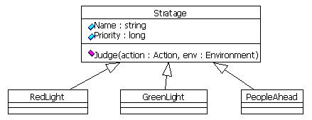
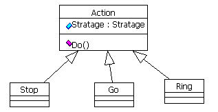

# KISS

- KISS = Keep It Stupid Simple
- KISS = Keep It Simple, Stupid

理解为“尽量简单、一目了然”会更好。

---
## KISS的含义

软件工程师和开发人员经常需要处理非常复杂的问题，一般来说开发人员会把问题拆分成更小的易于理解和实现的小问题，不过大多数人并没有将问题拆到足够小且易于理解的小问题。这会导致实现出来的代码比较复杂或非常复杂，比如类文件有500-1000行，类方法也有几百行，大部分都是异常处理、分支判断等。

其实如果开发人员能够进行深入的问题分析和分解是可以避免这种情况的。

---
## KISS的好处

- 能够更快地解决更多问题
- 能够用更少的代码解决复杂的问题
- 能够产生高质量的代码
- 能够构建更大但更容易维护的系统
- 代码在应对新需求时更加灵活、易于扩展、修改和重构
- 你能做得比你的想象还要好
- 如果代码都能符合KISS原则，则在大型开发团队和大型项目中就比较容易让新人顺利工作

---
## 如何应用KISS原则

有几个比较简单但富有挑战的步骤可以遵循，虽然KISS听起来简单，但是实现起来需要当事人有足够的耐心。

- 保持谦虚，不要认为自己是一个“天才”。其实谦虚反而使你能够达到“天才”的状态，呵呵。即使你不是天才，如果你的代码简单易懂，你就不必迫使自己变成天才来适应它。
- 将任务分解成你任务用4到12小时就能实现的子任务
- 将问题分解成小问题，每个问题用一个或较少的几个类就能解决
- 保持较小的类方法的代码长度，每个方法不能超过40行，每个方法只解决一个小问题而不是满足多个用例。如果方法里有大量的条件判断，将它们分解成更小的方法。这样做不仅仅容易阅读和维护，而且非常容易找寻bug。（将IDE里的“重构”操作变成你的最爱。）
- 保持类的代码长度，方法论类似上述的类方法。
- 先考虑怎么解决问题，然后编码实现。很多开发人员喜欢一边编码一边考虑怎么解决问题，我只能说这样做没错。
- 不要害怕扔掉旧代码。使用更好的方案解决新老问题时，重构和重新编码是两个非常重要的方式。丢掉就代码会使可能被重写的代码保持最少。
- 无论何时，尽可能的保持KISS，事实上这个行为模式的运用还是很难的，不过一旦你具备了这个能力，你在回顾过去的开发工作时就会惊呼“不敢想象我曾这样工作过！”。

---
## 扩展

*Keep It Simple and Stupid, 就是KISS原则. 简单是软件设计之美, 简单的设计使得软件产品易于开发, 易于维护. 简单代表着高质量, 少加班, 每个人都希望自己的工作是简单的.*

*在KISS原则之外, 应该有一个更重要的原则: Useful. 满足需求是一切产品的低限. 也许需求本身也应该KISS, 简单的需求意味着底成本, 高效率. 可惜客户有时候很难克制自己的欲望. 也许站在客户角度看见的KISS和我们开发者眼中的KISS不完全是一个概念. 有人说: 好的设计是客户做出来的, 开发者其实只是在帮助客户做设计.*

*Keep It Simple and Stupid, 最难的在于Keep. 一个人做一个Simple的设计并不难, 难的是让这个设计在需求变化的过程中保持简单. Keep是关键, Keep的时间就是这个设计的生命. 当一个产品无法再Keep Simple的时候, 维护就变的越来越困难, 渐渐的无法加入任何变化, 他的生命也就快结束了. 升级意味着重新做一个.*

---
## 实例
*Keep Simple就是要抵抗需求的变化, 一开始的需求总是比较简单*

比如：设计一个汽车驾驶程序, 他会在遇到红灯的时候停下来, 绿灯的时候向前进. *

---
### 方案一

<pre>
<code>
if red_light then
    stop()
else if green_light then
    go()
end if
</code>
</pre>

这是一个简单的需求, 给出的解决方案也很简单. But, 如果遇到这样的情景: 红灯已经亮了, 但是车前面有个人正在过马路, 他走的很慢. 这个时候当然不能go, 应该按响车喇叭, 等他走过去. 方案一必须要修改: 

<pre>
<code>
if red_light then
    stop()
else if green_light then
    if people_ahead then
        ring()
    else
        go()
    end if
end if
</code>
</pre>

现实的情况仍然可能发生变化, 比如: 前面尽管是绿灯, 但是横向路口一辆救护车开过来, 或者前面有一个路牌"道路维修请绕行"......种种情况, 其结果就是要在原来的if-else里面加上一个新的判断.

这是一个Simple的设计, 但是很难Keep Simple. 当这个代码片断不断增加, 长度突破500行的时候, 任何相关的需求变更都是一场恶梦. 在软件开发中更复杂的情况我想大家都遇到过.

---
###  方案二

想象有一个叫做策略的东西, 他有下面的特征: 他有一个名称, 一个优先级, 他可以判断某种情景, 返回在这个情景中应该采取的行为. 红灯停, 绿灯行, 有人在前面要按喇叭, 都是具体的策略. 就是下面这个结构:

还应该有一个Action, 代表策略判断后应该采取的行为. 前进, 停止, 按喇叭都是具体的行为, 这样的结构: 

最后的程序运行过程就是这样: 先初始化一个stratage list, 将需要判断的策略都放在里面. 在需要的地方一一判断这些策略, 执行优先级最高的策略所返回的行动就可以了. 

<pre>
<code>

dim action as new Action
for each stratage in stratage_list
    if stratage.Priority < action.Stratage.Priority then
        '如果当前的策略优先级小于行为的策略的优先级,就不用判断这个策略了
        continue
    end if
    stratage.Judge(action, env)
next
action.Do()
</code>
</pre>

这样的设计, 随着需求的变化, 策略日益复杂, 只要添加新的stratage, 赋予合适的优先级, 再视情况派生新的action就可以了. 程序的复杂程度不会随之增加.

---
## Quick & Dirty vs 过度设计

设计应该始于简单, 保持简单. 作出一个简单的设计, 当需求发生变化, 首先应该做的就是重构设计, 使之重新变得简单, 然后再加上新的功能. 简单不是quick and dirty. 简单的东西也许会变得复杂, 复杂的东西也许本质上是更加的简单. 这首先需要对需求充分的理解, 当然还有一点点的技巧. 过分的设计也是一个问题, 但是考虑一下维护人员的痛苦, 一个过度设计的系统通常要比一个quick and dirty的系统更加便于维护. 

---
## 参考资料

* [The Kiss Principle](http://people.apache.org/~fhanik/kiss.html)
* [Keep It Simple and Stupid](http://www.cnblogs.com/lane_cn/archive/2005/07/14/192775.html/archive/2005/07/14/192775.html)
